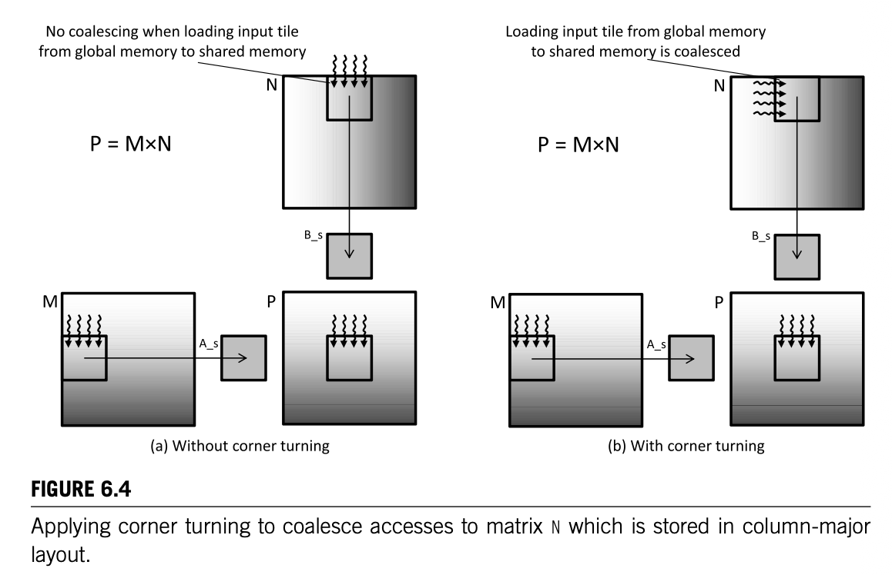

#### *1. Consider the following CUDA kernel. For each of the folowing memory accesses, specify whether they are coalesced, uncoalesced, or if coalescing is not applicable:*
```c++
__global__ void foo_kernel(float* a, float* b, float* c, float* d, float* e)  // 01
{
    unsigned int i = blockIdx.x*blockDim.x+threadIdx.x;                       // 02
    __shared__ float a_s[256];                                                // 03
    __shared__ float bc_s[4*256];                                             // 04
    a_s[threadIdx.x] = a[i];                                                  // 05
    for (unsigned int j = 0; j < 4; ++j)                                      // 06
    {
        bc_s[j*256 + threadIdx.x] = b[j*blockDim.x*gridDim.x + i] + c[i*4 + j];  // 07
    }
    __syncthreads();                                                          // 08
    d[i+8] = a_s[threadIdx.x];                                                // 09
    e[i*8] = bc_s[threadIdx.x*4];                                             // 10
}
```
- #### *a. The access to array `a` of line 05*
    - Yes, accesses to array `a` in line 05 can be coalesced. We see that consecutive threads (consecutive values of `i`) access consecutive values in `a`. 

- #### *b. The access to array `a_s` of line 05*
    - No. Coalescing is not applicable here. Global memory coalescing rules do not apply in shared memory, which is a faster access memory structure and hence does not rely on DRAM bursts to make focused use of data. 

- #### *c. The access to array `b` of line 07*
    - Yes. `b` is an array stored in global memory (accesses to it are not done with constant indexes, and hence the compiler can't optimize the array as constant stored in a register) and the term `j*blockDim.x*gridDim.x` is uniform across all threads. That is, it will evaluate to the same value for all threads. We also know that the `+i` term will make the final index value consecutive for consecutive threads, so threads read contiguous locations in global memory. 

- #### *d. The access to array `c` of line 07*
    - No. Even if `c` is an array stored in global memory and `j` is a uniform value across all threads, the term `i*4` forces consecutive threads to access non-contiguous locations in memory. For instance, keeping `j` fixed at 0, thread 0 will access `b[0]`, thread 1 will access `b[4]`, thread 2 will access `b[8]`, and so on. We see that consecutive threads access memory locations 16 bytes apart. 

- #### *e. The access to array `bc_s` of line 07*
    - No. Shared memory. 

- #### *f. The access to array `a_s` of line 09*
    - No. Shared memory. 

- #### *g. The access to array `d` of line 09*
    - Yes. a constant offset of `+8` does not affect consecutive threads accessing contiguous elements in global memory `d[i+8]`, `d[i+9]`, `d[i+10]`, .... 

- #### *h. The access to array `bc_s` of line 10*
    - No. Shared memory. 

- #### *i. The access to array `e` of line 10*
    - No. See d.

#### *2. Write a matrix multiplication kernel function that uses corner turning, corresponding to the design illustrated here: 

[^1]

[^1]: Hwu, W. W., Kirk, D. B., & El Hajj, I. *Programming Massively Parallel Processors: A Hands-on Approach* (5th ed.). Morgan Kaufmann.


